# Project 3

## F3 CrowdFunding For Real Estate 

Compile and Deployment of Smart Contract demo1.sol

* Compile

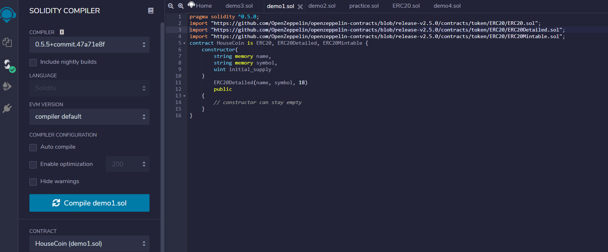

* Deploy HouseCoin/browser/demo1.sol
* Fill in name, symbol, Intial_supply

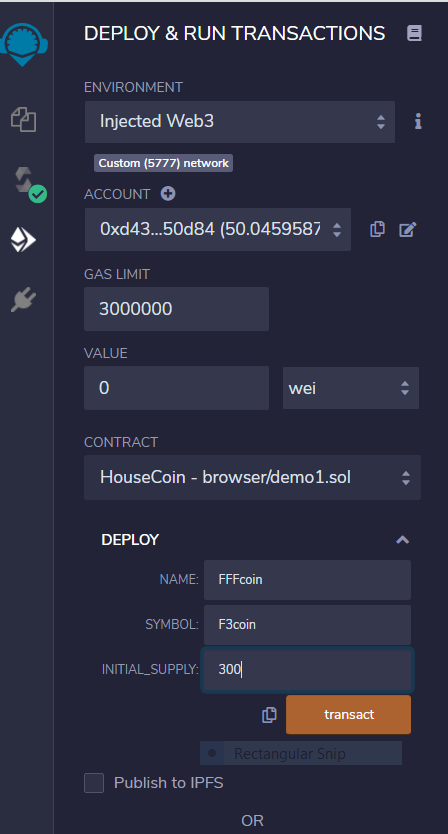

* confirm

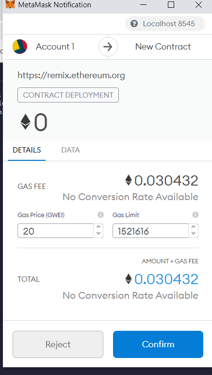

* menu bar should show up when contract tab expanded
* Can now run transactions

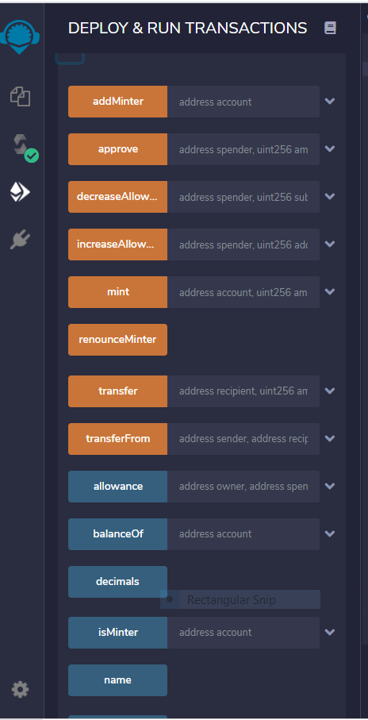

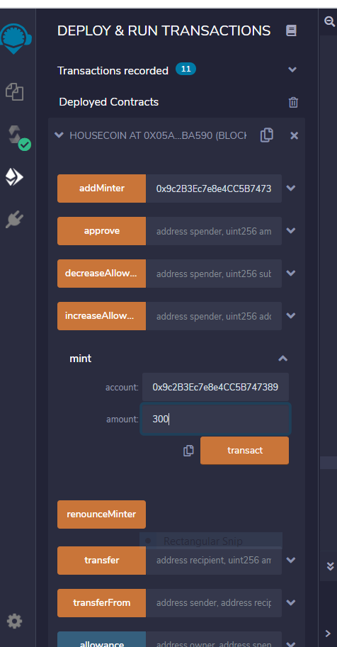

* compile contract demo2.sol

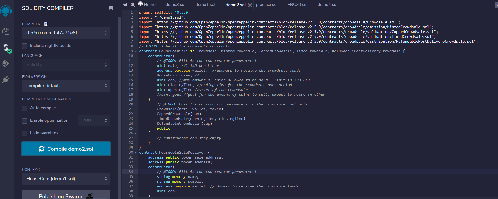

* Deploy HouseCoinSaleDeployer with required information

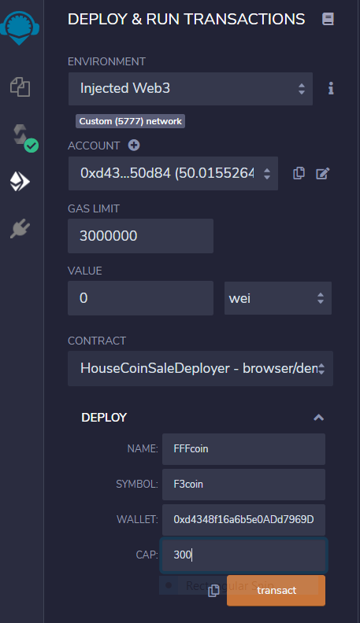

* Confirm

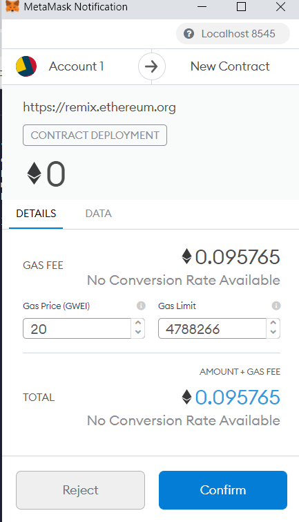

* Addresses to use for deployment of the rest ot the contract

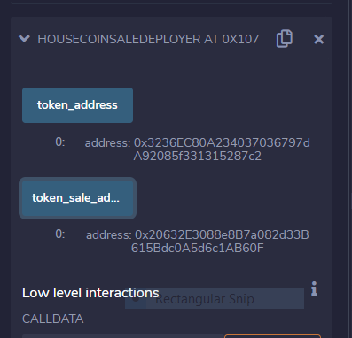

* Use token_address to deploy HouseCoinSale with the At Address button

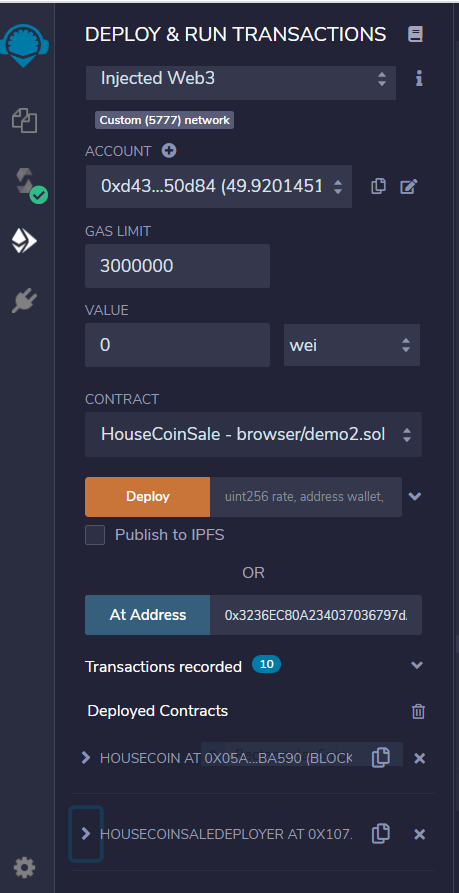

* Can now run transactions

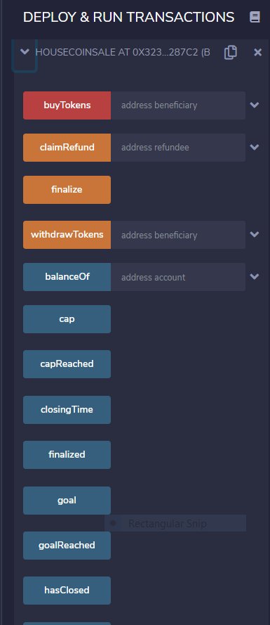

* Compile demo3.sol

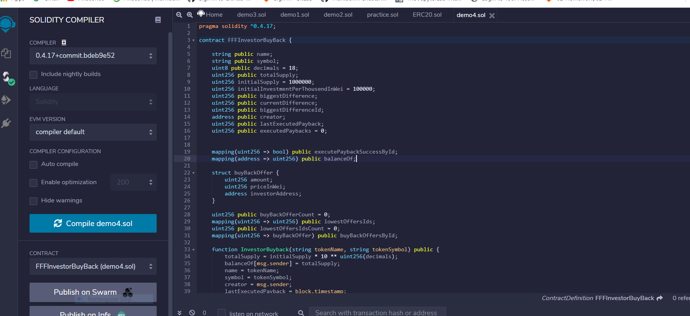

* Confirm

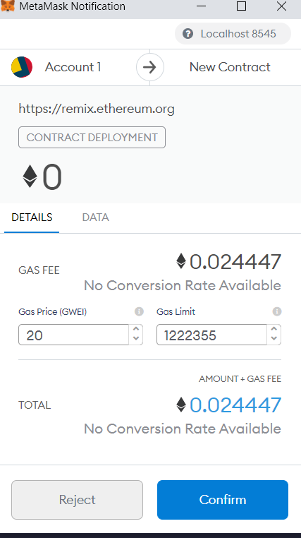

* Deploy with required information

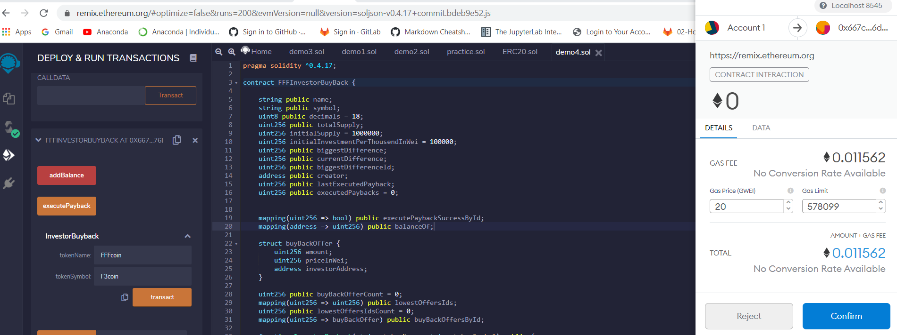

* Confirm

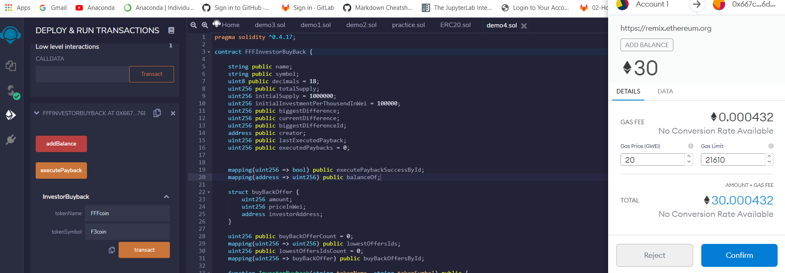

* Ready for Buy Back

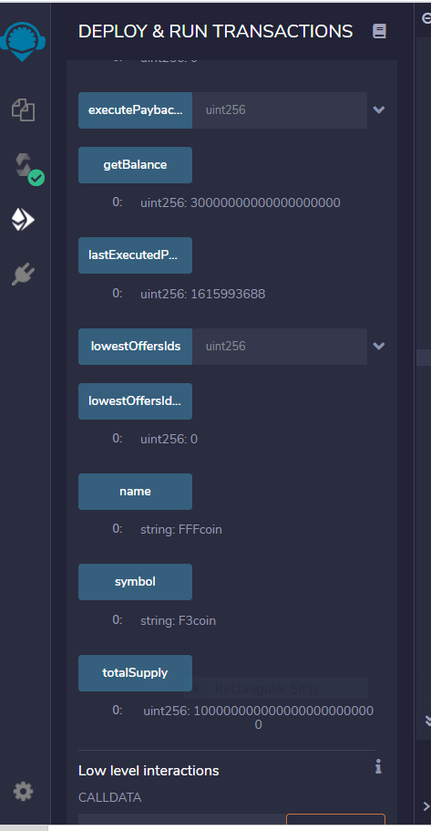

Deploy Frontend Dapp Website on local host

* Deploy Contracts with ganache

* Save token_sale_address and the wallet address associated with token account and add to buydapp.js and indexdapp.js under contract_address and wallet_address

* Open terminal and cd to frontend folder

* Run command "python -m http.server 8000"

* Navigate to "Localhost:8000" in browser